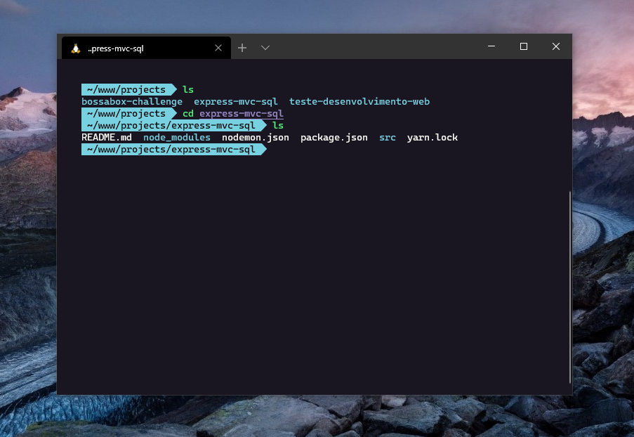

# Omni for [Windows Terminal](https://github.com/microsoft/terminal)





#### Download

Download using the [GitHub .zip download](#) option

#### Install

Start Windows Terminal and click on the down arrow symbol `˅` from menu bar. This will open a drop down menu from which select Settings option. Alternatively use `Ctrl + ,` to open Settings directly.

In the `profile.json` settings file for Windows Terminal, find the `schemes` section and paste the content of `omni.json`.

Example:

```json
"schemes": [
    {
        "name": "Omni",
        "background": "#191622",
        "black": "#000000",
        "blue": "#78D1E1",
        "cyan": "#8d79ba",
        "foreground" : "#F8F8F2",
        "green": "#50fa7b",
        "purple": "#988bc7",
        "red": "#ff5555",
        "white": "#bfbfbf",
        "yellow": "#effa78",
        "brightBlack": "#4d4d4d",
        "brightBlue": "#78D1E1",
        "brightCyan": "#aa91e3",
        "brightGreen": "#5af78e",
        "brightPurple": "#988bc7",
        "brightRed": "#ff6e67",
        "brightWhite": "#e6e6e6",
        "brightYellow": "#eaf08d"
    }
]
```

#### Activate

Once the color scheme has been defined, it's time to enable it. Find the `profiles` section and add a `colorScheme` value to the default profile.

Example:

```json
"profiles": {
    "defaults": {
        "colorScheme" : "Omni"
    }
}
```


## License

[MIT License](./LICENSE)